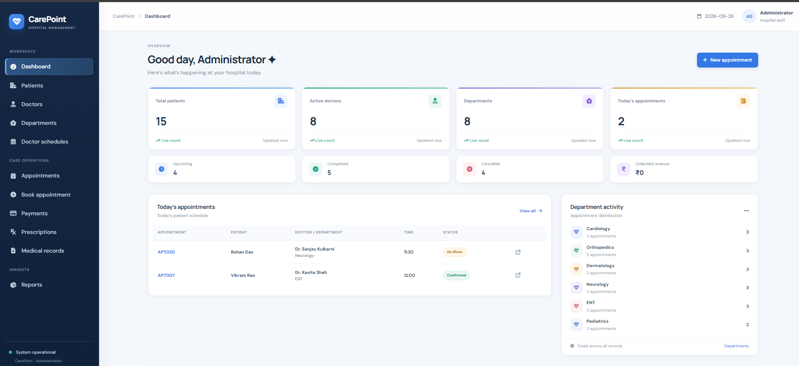
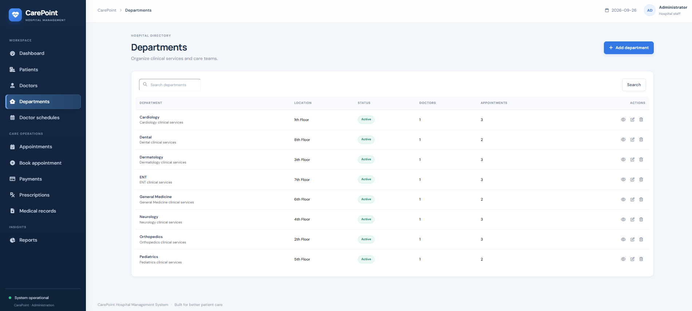
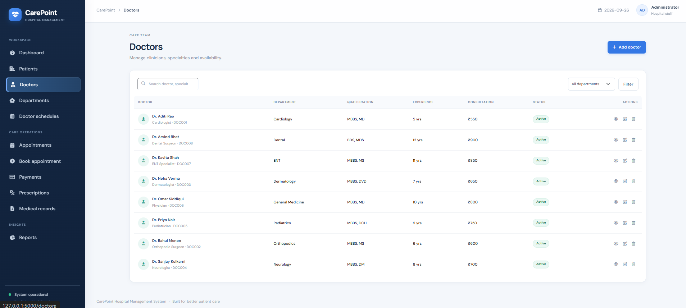
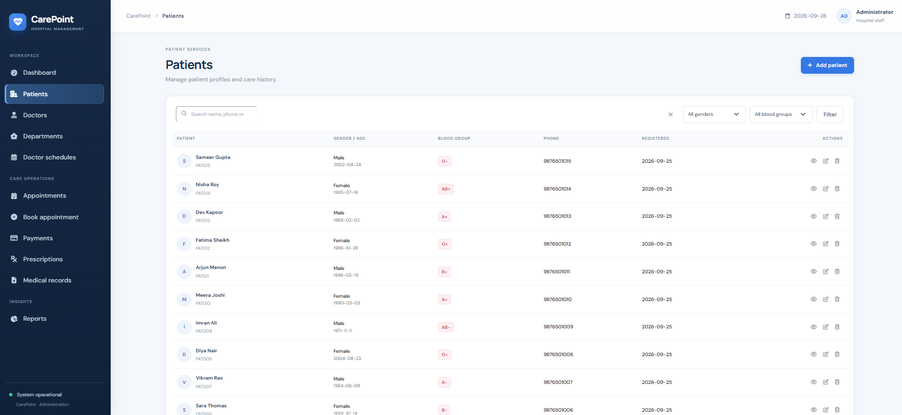

# HOSPITAL APPOINTMENT MANAGEMENT SYSTEM

**Project README / Reference Document**

**Author:** Huzaifa shariff  
**USN:** U18IN24S0018

## GitHub

[https://github.com/huzaifa-shariff/Hospital-Appointment-Management-System](https://github.com/huzaifa-shariff/Hospital-Appointment-Management-System)

## Hospital Appointment Management System

A web-based Hospital Appointment Management System developed using Python, Flask, SQLite, HTML5, CSS3, Bootstrap 5, and JavaScript. The application helps hospital staff manage patients, departments, doctors, recurring schedules, appointments, payments, prescriptions, and medical records through a responsive browser-based administration website.

Appointment booking uses doctor schedules and available time slots. The system validates a booking on the server and prevents two active appointments from using the same doctor's slot on the same date.

---

## Features

- Patient Registration and Profile Management
- Department Management
- Doctor and Specialty Management
- Doctor Schedule Configuration
- Appointment Booking and Editing
- Department-Based Doctor Selection
- Available Time Slot Lookup
- Duplicate Appointment Prevention
- Appointment Search and Filtering
- Appointment Confirmation, Completion, and Cancellation
- Appointment Rescheduling
- Patient Appointment History
- Payment Recording and Receipt View
- Prescription Management
- Linked Medical Record Creation
- Dashboard Statistics and Activity Summary
- Appointment, Doctor, Department, and Revenue Reports
- Appointment Data Export to CSV
- JSON API Endpoints for Booking and Dashboard Data
- Persistent SQLite Database Storage
- Foreign-Key and Database Constraint Enforcement
- Responsive Bootstrap Hospital Administration Interface
- Status Badges, Form Feedback, Confirmation Prompts, and Empty States

---

## Tech Stack

### Frontend

- HTML5
- CSS3
- Bootstrap 5
- JavaScript
- Font Awesome
- Jinja2 Templates

### Backend

- Python 3
- Flask

### Database

- SQLite
- Relational tables with foreign-key relationships
- Unique constraints for patient and doctor codes, recurring schedules, and active appointment slots

### Appointment Scheduling

- Doctor availability configured by weekday, working hours, and slot duration
- Available slots generated for the selected doctor and appointment date
- Server-side validation of schedule, date, and duplicate-slot rules
- Database uniqueness constraint as a final safeguard against duplicate active bookings

---

## Project Structure

```text
Hospital Appointment Management System 2/
│── app.py                         # Flask routes, validation, queries, and database setup
│── requirements.txt               # Flask dependency
│── README.md                      # Project documentation
│── database.db                     # Created locally when the app initializes
│
├── static/
│   ├── css/
│   │   ├── style.css               # Base hospital administration styles
│   │   ├── polish.css              # Refined layout and visual styling
│   │   └── activity.css            # Dashboard activity styling
│   └── js/
│       └── script.js               # Dynamic booking and interface interactions
│
└── templates/
    ├── base.html                   # Shared navigation and page layout
    ├── index.html                  # Dashboard
    ├── patients.html               # Patient directory
    ├── add_patient.html            # Patient registration form
    ├── patient_details.html        # Patient profile and history
    ├── departments.html            # Department directory
    ├── department_form.html        # Department add/edit form
    ├── department_details.html     # Department details
    ├── doctors.html                # Doctor directory
    ├── doctor_form.html            # Doctor add/edit form
    ├── doctor_details.html         # Doctor details
    ├── schedules.html              # Doctor schedule directory
    ├── schedule_form.html          # Schedule form
    ├── appointments.html           # Appointment search and list
    ├── book_appointment.html       # Appointment booking form
    ├── edit_appointment.html       # Appointment rescheduling form
    ├── appointment_details.html   # Appointment details
    ├── payments.html               # Payment directory
    ├── add_payment.html            # Payment entry form
    ├── payment_receipt.html        # Payment receipt
    ├── prescriptions.html          # Prescription directory
    ├── add_prescription.html       # Prescription entry form
    ├── prescription_details.html   # Prescription details
    ├── medical_records.html        # Medical record directory
    ├── reports.html                # Reports and CSV export
    ├── 404.html                    # Not-found page
    └── 500.html                    # Server-error page
```

---

## Database Tables

The system uses SQLite to store hospital operations and clinical records. Foreign keys connect appointments, payments, prescriptions, and medical records to their related patients, doctors, and departments.

### Patient Table

| Field | Description |
|---|---|
| Patient ID | Unique patient identifier |
| Patient Code | Unique human-readable patient reference |
| Full Name | Patient name |
| Date of Birth | Patient date of birth, when provided |
| Gender | Patient gender, when provided |
| Blood Group | Patient blood group, when provided |
| Phone | Required contact phone number |
| Email | Email address, when provided |
| Address | Patient address, when provided |
| Emergency Contact Name | Emergency contact person |
| Emergency Contact Phone | Emergency contact phone number |
| Created At | Patient registration timestamp |

### Department Table

| Field | Description |
|---|---|
| Department ID | Unique department identifier |
| Department Name | Unique department name |
| Description | Department service description |
| Location | Department floor or location |
| Status | Active or inactive state |

### Doctor Table

| Field | Description |
|---|---|
| Doctor ID | Unique doctor identifier |
| Doctor Code | Unique human-readable doctor reference |
| Full Name | Doctor name |
| Specialization | Doctor's medical specialty |
| Department ID | Department associated with the doctor |
| Qualification | Professional qualifications |
| Phone and Email | Contact information |
| Consultation Fee | Configured consultation amount |
| Experience Years | Years of professional experience |
| Room Number | Doctor's clinic room |
| Available Days | Availability summary shown in the doctor profile |
| Status | Active or inactive state |
| Created At | Doctor record creation timestamp |

### Doctor Schedule Table

| Field | Description |
|---|---|
| Schedule ID | Unique schedule identifier |
| Doctor ID | Doctor associated with the schedule |
| Day of Week | Recurring weekday for availability |
| Start Time | Beginning of the available period |
| End Time | End of the available period |
| Slot Duration | Appointment length in minutes |
| Status | Active or inactive schedule state |

Each doctor's weekday and starting time combination is unique. Appointment slots are generated from the active schedule for the selected day.

### Appointment Table

| Field | Description |
|---|---|
| Appointment ID | Unique appointment identifier |
| Appointment Code | Unique human-readable appointment reference |
| Patient ID | Patient booked for the visit |
| Doctor ID | Doctor assigned to the visit |
| Department ID | Department for the visit |
| Appointment Date | Scheduled visit date |
| Appointment Time | Scheduled visit start time |
| Reason and Symptoms | Visit reason and reported symptoms |
| Status | Scheduled, confirmed, completed, cancelled, no-show, or rescheduled state |
| Notes | Additional appointment notes |
| Created At and Updated At | Appointment creation and update timestamps |

An active-slot uniqueness rule prevents overlapping duplicate bookings for the same doctor, date, and time. Cancelled appointments do not reserve a slot.

### Payment Table

| Field | Description |
|---|---|
| Payment ID | Unique payment identifier |
| Appointment ID | Appointment associated with the payment |
| Patient ID | Patient who made the payment |
| Payment Date | Date payment was recorded |
| Amount | Positive payment amount |
| Payment Mode | Selected payment method |
| Transaction Reference | Optional payment reference |
| Payment Status | Payment state |

### Prescription Table

| Field | Description |
|---|---|
| Prescription ID | Unique prescription identifier |
| Appointment ID | Appointment associated with the prescription |
| Patient ID | Patient receiving the prescription |
| Doctor ID | Doctor issuing the prescription |
| Diagnosis | Recorded diagnosis |
| Medicines | Medicines prescribed |
| Dosage | Medicine dosage details |
| Duration | Prescription duration |
| Instructions | Additional patient instructions |
| Created At | Prescription creation timestamp |

### Medical Record Table

| Field | Description |
|---|---|
| Record ID | Unique medical record identifier |
| Patient ID | Patient associated with the record |
| Appointment ID | Related appointment, if available |
| Doctor ID | Doctor associated with the record, if available |
| Diagnosis | Clinical diagnosis |
| Symptoms | Patient symptoms |
| Treatment | Treatment provided |
| Medical Notes | Additional clinical notes |
| Created At | Medical record creation timestamp |

---

## Appointment Booking Rules

Before an appointment is saved, the application checks the selected booking details.

The booking process considers:

- The patient, doctor, and department must exist.
- The selected doctor must belong to the selected department and be active.
- The appointment date must be valid and cannot be in the past.
- The doctor must have an active schedule for the weekday of the appointment.
- The requested time must match an available slot generated from that schedule.
- The same doctor cannot have another active appointment at the same date and time.
- Cancelled appointments release their time slot for a new booking.
- Rescheduling uses the same availability and duplicate-slot checks as a new booking.

The application checks these rules in Flask before saving and also relies on a SQLite unique index to protect active appointment slots.

---

## Application Workflow

1. Start the Flask application and initialize the SQLite tables and demonstration records.
2. Register patients with contact and emergency-contact details.
3. Create departments and add doctors to the appropriate departments.
4. Set doctor specialties, qualifications, consultation fees, room numbers, and availability details.
5. Configure recurring doctor schedules by weekday, working hours, and slot duration.
6. Open the appointment booking page and select a patient, department, doctor, and date.
7. Load eligible doctors and open time slots for the selected booking details.
8. Submit the appointment and validate the schedule and requested slot on the server.
9. Search or filter appointments and view appointment details.
10. Confirm, complete, cancel, or reschedule an appointment when its status needs to change.
11. Record a payment and view or print the payment receipt.
12. Add a prescription; the workflow also creates a linked medical record and completes the visit.
13. Review a patient's appointment history and medical records.
14. Use dashboard statistics and reports to review hospital activity.
15. Export appointment report data as a CSV file when needed.

---

## Working Flow

```text
Patient Registration
        ↓
Departments and Doctors
        ↓
Doctor Weekly Schedules
(Weekday + Start + End + Slot Duration)
        ↓
Appointment Booking Form
(Patient + Department + Doctor + Date)
        ↓
Doctor and Slot Lookup
(Flask JSON API + JavaScript)
        ↓
Server-Side Schedule and Duplicate Validation
        ↓
Appointment Saved in SQLite
        ↓
Search / Confirm / Reschedule / Cancel / Complete
        ↓
Payments + Prescriptions + Medical Records
        ↓
Dashboard Statistics + Reports + CSV Export
```

---

## Appointment Booking Process

### 1. Select the Patient and Department

The booking form loads patient and department choices from the database. The selected department is used to narrow the doctor list.

### 2. Load Eligible Doctors

The browser requests the active doctors for the selected department from the Flask API. Doctor information, including specialization and consultation fee, is returned as JSON.

### 3. Choose the Appointment Date

The selected date determines the weekday schedule the server will use when looking up time slots.

### 4. Find Available Time Slots

The browser requests open slots for the selected doctor and date. Flask builds the slots from active recurring schedules and removes times already reserved by non-cancelled appointments.

### 5. Validate the Booking

On submission, Flask checks the patient and doctor references, department relationship, appointment date, active schedule, selected time, and duplicate booking rule. A SQLite unique index provides a final duplicate-slot safeguard.

### 6. Save or Reschedule

Valid appointments are saved in SQLite. Editing an appointment runs availability checks while excluding the appointment being edited. Cancelling a booking frees the time for another patient.

---

## Data Management

The system connects its records using SQLite foreign keys. Deletion is guarded where dependent records need to remain available: for example, patients and doctors with related appointments cannot be deleted while those dependencies remain. Department deletion is also restricted when doctors are assigned to the department.

Schedule rows are associated with their doctor and removed when that doctor is deleted. Payment and prescription rows are associated with appointments. Medical records retain their patient relationship, while optional links to a deleted appointment or doctor can be cleared by the database. These rules help preserve valid relationships across the hospital records.

---

## User Interface

The application interface includes:

- Shared Sidebar and Navigation Area
- Hospital Dashboard
- Summary Cards and Activity Feed
- Today's and Upcoming Appointment Lists
- Patient, Doctor, and Department Tables
- Patient and Doctor Detail Pages
- Schedule Management Pages
- Appointment Booking and Rescheduling Forms
- Search and Filter Controls
- Status Badges and Validation Messages
- Payment Entry and Receipt View
- Prescription and Medical Record Pages
- Period-Based Reports and CSV Export
- Responsive Layout for Desktop, Tablet, and Mobile Screens
- Empty States, Alerts, and Form Confirmation Prompts

---

## Security and Data Integrity

The application uses the following data-integrity measures:

- Parameterized SQLite queries for database values
- SQLite foreign-key enforcement on database connections
- Unique patient and doctor codes
- Unique doctor schedule entries for a weekday and start time
- Unique active appointment slots for a doctor, date, and time
- Server-side validation of form values and related record IDs
- Date, schedule, department, and duplicate checks before appointment writes
- Database checks for non-negative consultation fees and positive payments
- Foreign-key delete rules to protect dependent records

The project is configured for local academic demonstration and does not include user login or role-based access control.

---

## Routes and API Endpoints

### Main Pages

| Area | Routes |
|---|---|
| Dashboard | `/` |
| Patients | `/patients`, `/patients/add`, `/patients/view/<id>`, `/patients/edit/<id>` |
| Departments | `/departments`, `/departments/add`, `/departments/view/<id>`, `/departments/edit/<id>` |
| Doctors | `/doctors`, `/doctors/add`, `/doctors/view/<id>`, `/doctors/edit/<id>` |
| Schedules | `/schedules`, `/schedules/add` |
| Appointments | `/appointments`, `/appointments/book`, `/appointments/view/<id>`, `/appointments/edit/<id>` |
| Payments | `/payments`, `/payments/add`, `/payments/view/<id>` |
| Prescriptions | `/prescriptions`, `/prescriptions/add`, `/prescriptions/view/<id>` |
| Medical Records | `/medical-records` |
| Reports | `/reports`, `/reports/appointments`, `/reports/revenue`, `/reports/appointments.csv` |

### JSON APIs

| Endpoint | Purpose |
|---|---|
| `GET /api/doctors/<department_id>` | Return active doctors in a selected department. |
| `GET /api/available-slots/<doctor_id>/<YYYY-MM-DD>` | Return open time slots for a doctor and date. |
| `GET /api/patient/<patient_id>` | Return patient details for the booking interface. |
| `GET /api/appointments/today` | Return today's appointment codes, times, and statuses. |

---

## Installation

### 1. Open the Project Folder

Open a terminal in the folder containing `app.py` and `requirements.txt`.

### 2. Create a Virtual Environment

```bash
python -m venv venv
```

### 3. Activate the Virtual Environment

#### Linux / macOS

```bash
source venv/bin/activate
```

#### Windows PowerShell

```powershell
.\venv\Scripts\Activate.ps1
```

If PowerShell blocks activation, use Command Prompt instead:

```bat
venv\Scripts\activate.bat
```

### 4. Install Dependencies

```bash
pip install -r requirements.txt
```

The application requires Flask:

```text
Flask>=3.0,<4.0
```

### 5. Run the Application

```bash
python app.py
```

### 6. Open the Website

Visit the local Flask address:

```text
http://127.0.0.1:5000/
```

The SQLite database schema and fictional demonstration data are initialized automatically when the application starts. Keep the terminal running while using Flask, or configure a local startup launcher for automatic start after Windows sign-in.

---

## Screenshots

The screenshots below show the application dashboard and its main directories. Click an image to view it at full size.

### Dashboard



### Departments



### Doctor schedules


### Doctors



### Patients



---

## Future Enhancements

- User Login and Authentication
- Administrator, Doctor, and Staff Roles
- Patient Self-Service Portal
- Appointment Email or SMS Reminders
- Online Payment Gateway Integration
- PDF Export for Receipts and Reports
- Doctor Availability Preferences and Leave Management
- Waiting List for Fully Booked Time Slots
- Appointment Notifications and Audit History
- Advanced Revenue and Department Analytics
- Automated Database Backup and Restore
- Production Deployment with a Dedicated WSGI Server

---

## Learning Outcomes

- Python Programming
- Flask Web Application Development
- SQLite Database Design
- Relational Database Concepts and Foreign Keys
- HTML5, CSS3, Bootstrap, and JavaScript
- Jinja2 Template Inheritance
- Create, Read, Update, and Delete Workflows
- Form Validation and User Feedback
- Parameterized Database Queries
- JSON API Integration with JavaScript Fetch
- Appointment Availability and Duplicate Prevention
- Dashboard Aggregation and Report Generation
- CSV File Export
- Responsive Full-Stack Website Development

---

## Author

**Student Name:** Huzaifa Shariff

**USN:** U18IN24S0018

**Course:** BCA

**Project:** Hospital Appointment Management System

**Technologies:**

Python | Flask | SQLite | HTML5 | CSS3 | Bootstrap 5 | JavaScript | Jinja2

---

## GitHub

https://github.com/huzaifa-shariff/Hospital-Appointment-Management-System

---

## License

This project is developed for educational, academic, internship, and portfolio purposes. It is a demonstration system and is not configured for handling real patient information or production hospital operations.
